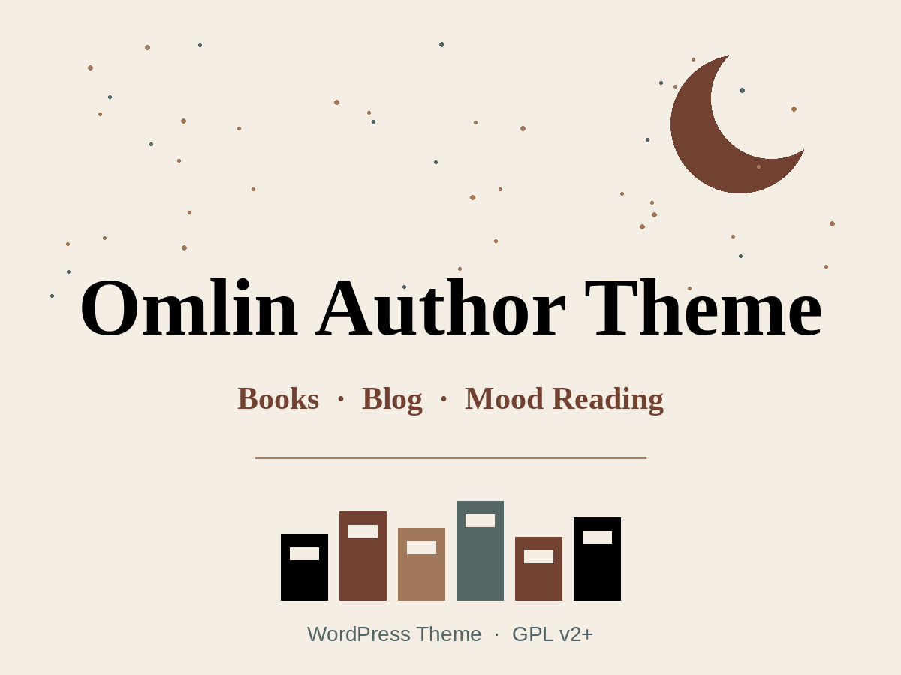

# Omlin Author Theme

A custom WordPress theme designed for authors, featuring a book showcase, blog, interactive mood selection, and night mode functionality.

**Developed by [Omnia Ahmed](https://github.com/topweb4all)**



## 📋 Features

- **Responsive Design**: Works perfectly on all devices
- **Night Mode**: Toggle between light and dark themes
- **Interactive Mood Selection**: Readers can choose their mood to see relevant quotes
- **Books Custom Post Type**: Easy management of book catalog
- **Genre Taxonomy**: Organize books by genre
- **Blog Integration**: Share thoughts and updates with readers
- **Contact Form**: Built-in contact form with email notifications
- **Google Fonts Integration**: Beautiful typography with Cinzel Decorative, Alice, DM Sans, and Cormorant Garamond

## 🎨 Brand Colors

- **Black**: `#000000`
- **Beige**: `#f5eee5`
- **Brown Dark**: `#714231`
- **Brown Medium**: `#a2785b`
- **Brown Light**: `#536564`

## 📦 Installation

### Method 1: Manual Installation

1. Download the theme files
2. Upload the theme folder to `/wp-content/themes/`
3. Activate the theme through WordPress admin panel
4. Create required pages:
   - Home (set as Front Page)
   - Books (use "Books Page" template)
   - Blog (set as Posts Page)
   - Contact (use "Contact Page" template)

### Method 2: Local Development with VS Code

1. Install Local by Flywheel or XAMPP
2. Create a new WordPress site
3. Navigate to `wp-content/themes/`
4. Clone or copy theme files
5. Open in VS Code
6. Activate theme in WordPress admin

## 🚀 Setup Guide

### 1. Theme Activation

1. Go to **Appearance > Themes**
2. Activate **Omlin Author Theme**

### 2. Create Required Pages

Create the following pages in WordPress:

#### Home Page
- Title: Home
- Template: Default
- Content: Leave empty (template handles everything)
- Settings > Reading > Set as Front Page

#### Books Page
- Title: Books
- Template: Books Page
- Content: Optional intro text

#### Blog Page
- Title: Blog
- Template: Default
- Settings > Reading > Set as Posts Page

#### Contact Page
- Title: Contact
- Template: Contact Page
- Content: Optional intro text

### 3. Setup Navigation Menu

1. Go to **Appearance > Menus**
2. Create a new menu called "Primary Menu"
3. Add pages: Home, Books, Blog, Contact
4. Assign to "Primary Menu" location

### 4. Add Books

1. Go to **Books > Add New**
2. Enter book details:
   - Title
   - Description (main content)
   - Excerpt (short description)
   - Featured Image (book cover)
   - Genre (taxonomy)
3. In "Book Details" meta box:
   - Buy Link (Amazon, etc.)
   - Preview Link (optional)
4. Publish

### 5. Customize Logo

1. Go to **Appearance > Customize > Site Identity**
2. Upload your logo
3. Or use the default text logo

## 📁 File Structure

```
theme/
│
├── style.css                 # Theme info + base styles
├── functions.php             # Theme setup + features
├── index.php                 # Fallback template
├── header.php                # Header with navigation
├── footer.php                # Footer
├── front-page.php            # Homepage
├── page-books.php            # Books archive page
├── single.php                # Single blog post
├── page-contact.php          # Contact page
│
├── template-parts/
│   ├── hero.php              # Latest book showcase
│   ├── mood.php              # Mood selection
│   ├── books-grid.php        # Books grid display
│   └── blog-highlights.php   # Recent blog posts
│
├── assets/
│   ├── css/
│   │   ├── main.css          # Main styles
│   │   └── night-mode.css    # Dark theme styles
│   ├── js/
│   │   ├── mood.js           # Mood functionality
│   │   └── night-mode.js     # Night mode toggle
│   └── images/
│
└── README.md                 # This file
```

## 🎯 Key Features Explained

### Books Custom Post Type

The theme creates a custom post type "Books" with:
- Title, Content, Excerpt, Featured Image
- Genre taxonomy for categorization
- Custom meta fields for Buy Link and Preview Link

**Usage:**
```php
// Get all books
$books = omlin_get_all_books();

// Get latest book
$latest = omlin_get_latest_book();
```

### Mood Selection

Interactive mood selection that changes:
- Background colors
- Quote display
- User experience

**Moods Available:**
- Dark 🌑
- Romantic 💕
- Mysterious 🔮
- Hopeful ✨

### Night Mode

Persistent night mode using localStorage:
- Toggle button in header
- Smooth color transitions
- Respects system preferences

## 🎨 Customization

### Change Colors

Edit in `style.css`:
```css
:root {
  --color-black: #000000;
  --color-beige: #f5eee5;
  --color-brown-dark: #714231;
  --color-brown-medium: #a2785b;
  --color-brown-light: #536564;
}
```

### Add More Mood Quotes

Edit in `template-parts/mood.php`:
```javascript
{
  "dark": [
    {
      "text": "Your quote here",
      "source": "Book Title"
    }
  ]
}
```

### Customize Hero Section

Edit `template-parts/hero.php` to change:
- Layout
- Book stats
- CTA buttons

## 📧 Contact Form

The contact form sends emails to the WordPress admin email.

**To change recipient:**
```php
// In functions.php, find:
$to = get_option('admin_email');

// Change to:
$to = 'your@email.com';
```

## 🔧 Troubleshooting

### Books Not Showing

1. Make sure you've added books in **Books > Add New**
2. Check that featured images are set
3. Verify permalinks: **Settings > Permalinks > Save Changes**

### Contact Form Not Working

1. Test WordPress email with a plugin like **WP Mail SMTP**
2. Check spam folder
3. Verify admin email in **Settings > General**

### Night Mode Not Saving

1. Clear browser cache
2. Check browser localStorage is enabled
3. Try incognito mode to test

## 🎓 Development

### Local Development Setup

```bash
# Navigate to themes directory
cd wp-content/themes/

# Clone or copy theme
cp -r /path/to/omlin-author-theme .

# Open in VS Code
code omlin-author-theme
```

### File Watching

For CSS/JS changes, use a file watcher or simply refresh browser after changes.

### Debugging

Enable WordPress debugging in `wp-config.php`:
```php
define('WP_DEBUG', true);
define('WP_DEBUG_LOG', true);
define('WP_DEBUG_DISPLAY', false);
```

## 📝 Best Practices

### Adding Books

1. Use high-quality cover images (recommended: 600x900px)
2. Write compelling excerpts (100-150 words)
3. Add genre tags for better organization
4. Include both buy and preview links when possible

### Writing Blog Posts

1. Use featured images for better visual appeal
2. Categorize posts appropriately
3. Write SEO-friendly titles
4. Use excerpts for better display in blog grid

### Content Guidelines

1. Keep hero section updated with latest book
2. Update mood quotes seasonally
3. Maintain consistent tone across all content
4. Use high-quality images throughout

## 🚀 Performance Tips

1. **Optimize Images**: Use compressed images (WebP format recommended)
2. **Caching**: Use a caching plugin like WP Super Cache
3. **CDN**: Consider using a CDN for static assets
4. **Minification**: Minify CSS/JS in production

## 🔒 Security

1. Keep WordPress and theme updated
2. Use strong passwords
3. Implement SSL certificate
4. Regular backups
5. Use security plugins like Wordfence

## 📱 Browser Support

- Chrome (latest)
- Firefox (latest)
- Safari (latest)
- Edge (latest)
- Mobile browsers (iOS Safari, Chrome Mobile)

## 🤝 Support

For issues or questions:
1. Check this documentation
2. Review code comments
3. Test in browser console for JavaScript errors
4. Check WordPress debug log

## 📄 License

This theme is licensed under the GNU General Public License v2 or later.

## 🎉 Credits

- **Developer**: Omnia Ahmed — [GitHub](https://github.com/topweb4all)
- **Fonts**: Google Fonts
- **Icons**: Custom SVG icons

---

**Version**: 1.0.0  
**Last Updated**: December 2024  
**Developer**: Omnia Ahmed  
**GitHub**: https://github.com/topweb4all
